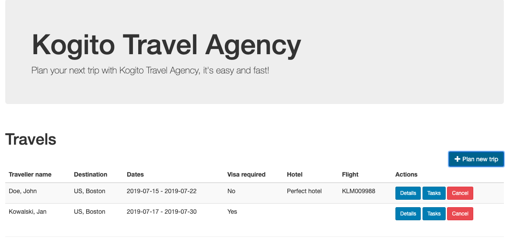

# IBM Travel Agency - base version

## Description

The system calls an ML service that approves a mortgage.  If approved, it runs DMN to apply incentive offers.


## Data model

IBM Mortgate Approve Agency booking system will be based on following data model

### Applicant

Applicant

### MortgageApplication
 Details of mortgage

### MortgageOffer

Mortgage Offer containing incentives

<p align="center"></p>

##ML service

The ML service checks the mortgage details and applys a approve boolean

<p align="center"></p>

## Business logic

Business logic will be based on DMN to apply simple incentive offers

### Installing and Running

#### Prerequisites

You will need:

* Java 11+ installed
* Environment variable JAVA_HOME set accordingly
* Maven 3.5.2+ installed

When using native image compilation, you will also need:

* GraalVM 20 installed
* Environment variable GRAALVM_HOME set accordingly
* Note that GraalVM native image compilation typically requires other packages (glibc-devel, zlib-devel and gcc) to be installed too, please refer to GraalVM installation documentation for more details.

#### Compile and Run in Local Dev Mode

```sh

mvn clean compile quarkus:dev


```

NOTE: With dev mode of Quarkus you can take advantage of hot reload for business assets like processes, rules and decision
tables and java code. No need to redeploy or restart your running application.

#### Compile and Run using Local Native Image

Note that this requires GRAALVM_HOME to point to a valid GraalVM installation

```sh
mvn clean package -Pnative
```

To run the generated native executable, generated in `target/`, execute

```sh
./target/kogito-travel-agency-{version}-runner
```


## User interface

IBM Travel Agency comes with basic UI that allows to

### Plan new trips

<p align="center"></p>

### List currently opened travel requests

<p align="center"></p>

### Show details of selected travel request

<p align="center"></p>

### Show active tasks of selected travel request

<p align="center"></p>

### Cancel selected travel request

To start IBM Travel Agency UI just point your browser to [http://localhost:8081](http://localhost:8081)

## REST API

Access the generated API here:

http://localhost:8081/q/swagger-ui/

business central:

http://localhost:8081/business-central/kie-wb.jsp


Once the service is up and running, you can use the following examples to interact with the service.

### POST /travels

Send travel that does not require visa

```sh
curl -H "Content-Type: application/json" -H "Accept: application/json" -X POST http://localhost:8081/travels -d @- << EOF
{
  "traveller" : {
    "firstName" : "John",
    "lastName" : "Doe",
    "email" : "john.doe@example.com",
    "nationality" : "American",
    "address" : {
      "street" : "main street",
      "city" : "Boston",
      "zipCode" : "10005",
      "country" : "US"
    }
  },
  "trip" : {
    "city" : "New York",
    "country" : "US",
    "begin" : "2019-12-10T00:00:00.000+02:00",
    "end" : "2019-12-15T00:00:00.000+02:00"
  }
}
EOF

```

This will directly go to 'ConfirmTravel' user task.

Send travel request that requires does require visa

```sh
curl -H "Content-Type: application/json" -H "Accept: application/json" -X POST http://localhost:8081/travels -d @- << EOF
{
  "traveller" : {
    "firstName" : "Jan",
    "lastName" : "Kowalski",
    "email" : "jan.kowalski@example.com",
    "nationality" : "Polish",
    "address" : {
      "street" : "polna",
      "city" : "Krakow",
      "zipCode" : "32000",
      "country" : "Poland"
    }
  },
  "trip" : {
    "city" : "New York",
    "country" : "US",
    "begin" : "2019-12-10T00:00:00.000+02:00",
    "end" : "2019-12-15T00:00:00.000+02:00"
  }
}
EOF
```

This will stop at 'VisaApplication' user task.

### GET /travels

Returns list of travel requests currently active:

```sh
curl -X GET http://localhost:8081/travels
```

As response an array of travels is returned.

### GET /travels/{id}

Returns travel request with given id (if active):

```sh
curl -X GET http://localhost:8081/travels/{uuid}
```

As response a single travel request is returned if found, otherwise 404 Not Found is returned.

### DELETE /travels/{id}

Cancels travel request with given id

```sh
curl -X DELETE http://localhost:8081/travels/{uuid}
```

### GET /travels/{id}/tasks

Returns currently assigned user tasks for give travel request:

```sh
curl -X GET http://localhost:8081/travels/{uuid}/tasks
```

### GET /travels/{id}/VisaApplication/{taskId}

Returns visa application task information:

```sh
curl -X GET http://localhost:8081/travels/{uuid}/VisaApplication/{task-uuid}
```

### POST /travels/{id}/VisaApplication/{taskId}

Complete visa application task by sending a valid URL to the VISA document stored in any cloud provider:

```sh
curl -H "Content-Type: application/json" -H "Accept: application/json" -X POST http://localhost:8081/travels/{uuid}/VisaApplication/{task-uuid} -d '{"visaApplication": "https://mydrive.example.com/JanVisaApplicationForm.pdf"}'
```

### GET /travels/{id}/ConfirmTravel/{taskId}

Returns travel (hotel, flight) task information required for confirmation:

```sh
curl -X GET http://localhost:8081/travels/{uuid}/ConfirmTravel/{task-uuid}
```

### POST /travels/{id}/ConfirmTravel/{taskId}

Completes confirms travel task - meaning confirms (and completes) the travel request

```sh
curl -H "Content-Type: application/json" -H "Accept: application/json" -X POST http://localhost:8081/travels/{uuid}/ConfirmTravel/{task-uuid} -d '{}'
```

## Known issues
